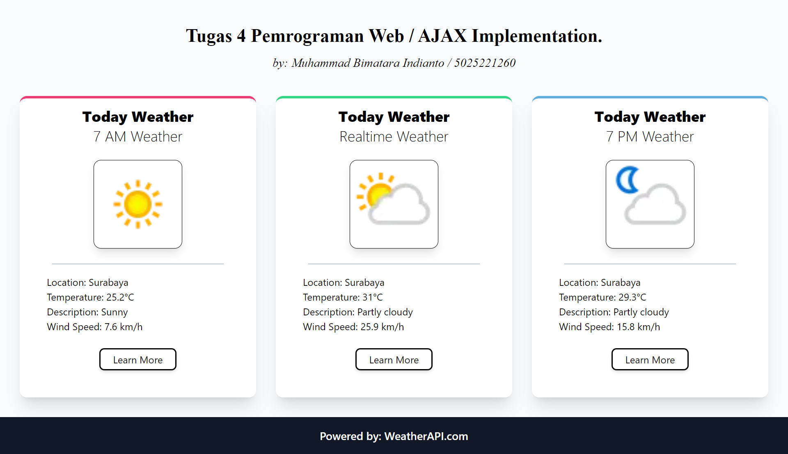

# TUGAS KEEMPAT PWEB PERTEMUAN 5

## Nama : Muhammad Bimatara Indianto
## NRP  : 5025221260

Diberikan sebuah tugas untuk mengimplementasikan metode AJAX (Asynchronous JavaScript And XML) pada sebuah halaman website sederhana. Metode ajax ini diimplementasikan dengan mengambil data dari sebuah API (weather API) dan ditampilkan ke sebuah halaman website. 

Shoutout to [WeatherAPI](https://www.weatherapi.com/) for providing the API Services^^